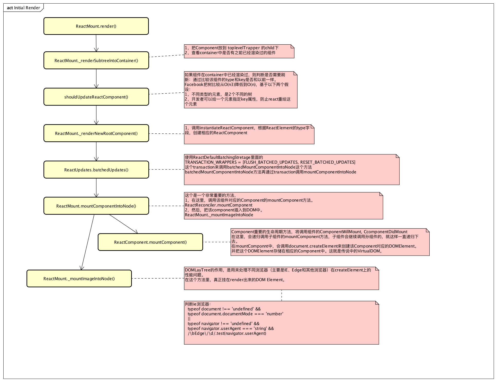

# MOUNT



## `\_renderSubtreeIntoContainer`

``` javascript
_renderSubtreeIntoContainer: function(parentComponent, nextElement, container, callback) {
  ReactUpdateQueue.validateCallback(callback, 'ReactDOM.render');

  // 把nextElement挂载到TopLevelWrapper的child下。
  var nextWrappedElement = React.createElement(
    TopLevelWrapper,
    { child: nextElement }
  );

  var nextContext;
  if (parentComponent) {
    var parentInst = ReactInstanceMap.get(parentComponent);
    nextContext = parentInst._processChildContext(parentInst._context);
  } else {
    nextContext = emptyObject;
  }

  // 获取要插入到的容器的前一次的ReactComponent，这是为了做DOM diff
  // 对于ReactDOM.render()调用，prevComponent为null
  var prevComponent = getTopLevelWrapperInContainer(container);

  if (prevComponent) {
    var prevWrappedElement = prevComponent._currentElement;
    // 从prevComponent中获取到prevElement这个数据对象。
    // 一定要搞清楚ReactElement和ReactComponent的作用，他们很关键
    var prevElement = prevWrappedElement.props.child;

    // DOM diff精髓，同一层级内，type和key不变时，只用update就行。否则先unmount组件再mount组件
    // 这是React为了避免递归太深，而做的DOM diff前提假设。
    // 它只对同一DOM层级，type相同，key(如果有)相同的组件做DOM diff，否则不用比较，直接先unmount再mount。
    // 这个假设使得diff算法复杂度从O(n^3)降低为O(n).
    if (shouldUpdateReactComponent(prevElement, nextElement)) {
      var publicInst = prevComponent._renderedComponent.getPublicInstance();
      var updatedCallback = callback && function() {
        callback.call(publicInst);
      };

      // 只需要update，调用_updateRootComponent，然后直接return了
      ReactMount._updateRootComponent(
        prevComponent,
        nextWrappedElement,
        nextContext,
        container,
        updatedCallback
      );
      return publicInst;
    } else {
      // 不做update，直接先卸载再挂载。
      // 即unmountComponent,再mountComponent。mountComponent在后面代码中进行
      ReactMount.unmountComponentAtNode(container);
    }
  }

  var reactRootElement = getReactRootElementInContainer(container);
  var containerHasReactMarkup =
    reactRootElement && !!internalGetID(reactRootElement);
  var containerHasNonRootReactChild = hasNonRootReactChild(container);

  var shouldReuseMarkup =
    containerHasReactMarkup &&
    !prevComponent &&
    !containerHasNonRootReactChild;

  // 初始化，渲染组件，然后插入到DOM中。_renderNewRootComponent很关键
  var component = ReactMount._renderNewRootComponent(
    nextWrappedElement,
    container,
    shouldReuseMarkup,
    nextContext
  )._renderedComponent.getPublicInstance();
  if (callback) {
    callback.call(component);
  }
  return component;
}
```

## `\_renderNewRootComponent`

``` javascript
_renderNewRootComponent: function(
  nextElement,
  container,
  shouldReuseMarkup,
  context
) {

  ReactBrowserEventEmitter.ensureScrollValueMonitoring();

  // 初始化ReactComponent，根据ReactElement中不同的type字段，创建不同类型的组件对象，即ReactComponent
  var componentInstance = instantiateReactComponent(nextElement, false);

  // The initial render is synchronous but any updates that happen during
  // rendering, in componentWillMount or componentDidMount, will be batched
  // according to the current batching strategy.
  // 处理batchedMountComponentIntoNode方法调用，将ReactComponent插入DOM中
  ReactUpdates.batchedUpdates(
    batchedMountComponentIntoNode,
    componentInstance,
    container,
    shouldReuseMarkup,
    context
  );

  var wrapperID = componentInstance._instance.rootID;
  instancesByReactRootID[wrapperID] = componentInstance;

  return componentInstance;
}
```

## `batchedMountComponentIntoNode`以transaction事务的形式调用`mountComponentIntoNode`

``` javascript
function mountComponentIntoNode(
  wrapperInstance,
  container,
  transaction,
  shouldReuseMarkup,
  context
) {
  var markerName;
  if (ReactFeatureFlags.logTopLevelRenders) {
    var wrappedElement = wrapperInstance._currentElement.props.child;
    var type = wrappedElement.type;
    markerName = 'React mount: ' + (
      typeof type === 'string' ? type :
      type.displayName || type.name
    );
    console.time(markerName);
  }

  // 调用对应ReactComponent中的mountComponent方法来渲染组件，这个是React生命周期的重要方法。后面详细分析。
  // mountComponent返回React组件解析的HTML。不同的ReactComponent的mountComponent策略不同，可以看做多态
  var markup = ReactReconciler.mountComponent(
    wrapperInstance,
    transaction,
    null,
    ReactDOMContainerInfo(wrapperInstance, container),
    context,
    0 /* parentDebugID */
  );

  if (markerName) {
    console.timeEnd(markerName);
  }

  wrapperInstance._renderedComponent._topLevelWrapper = wrapperInstance;
  // 将解析出来的HTML插入DOM中
  ReactMount._mountImageIntoNode(
    markup,
    container,
    wrapperInstance,
    shouldReuseMarkup,
    transaction
  );
}
```

## `\_mountImageIntoNode`

``` javascript
_mountImageIntoNode: function(
    markup,
    container,
    instance,
    shouldReuseMarkup,
    transaction
  ) {

  // 第一次渲染，shouldReuseMarkup为false
  if (shouldReuseMarkup) {
    var rootElement = getReactRootElementInContainer(container);
    if (ReactMarkupChecksum.canReuseMarkup(markup, rootElement)) {
      ReactDOMComponentTree.precacheNode(instance, rootElement);
      return;
    } else {
      var checksum = rootElement.getAttribute(
        ReactMarkupChecksum.CHECKSUM_ATTR_NAME
      );
      rootElement.removeAttribute(ReactMarkupChecksum.CHECKSUM_ATTR_NAME);

      var rootMarkup = rootElement.outerHTML;
      rootElement.setAttribute(
        ReactMarkupChecksum.CHECKSUM_ATTR_NAME,
        checksum
      );

      var normalizedMarkup = markup;

      var diffIndex = firstDifferenceIndex(normalizedMarkup, rootMarkup);
      var difference = ' (client) ' +
        normalizedMarkup.substring(diffIndex - 20, diffIndex + 20) +
        '\n (server) ' + rootMarkup.substring(diffIndex - 20, diffIndex + 20);
    }
  }

  // 初次render，useCreateElement is true
  if (transaction.useCreateElement) {
    while (container.lastChild) {
      container.removeChild(container.lastChild);
    }
    DOMLazyTree.insertTreeBefore(container, markup, null);
  } else {
    // 将markup这个HTML设置到container这个DOM元素的innerHTML属性上，这样就插入到了DOM中了
    setInnerHTML(container, markup);
    // 将instance这个ReactComponent渲染后的对象，即Virtual DOM，保存到container这个DOM元素的firstChild这个原生节点上。
    // 简单理解就是将Virtual DOM保存到内存中，这样可以大大提高交互效率
    ReactDOMComponentTree.precacheNode(instance, container.firstChild);
  }
}
```
