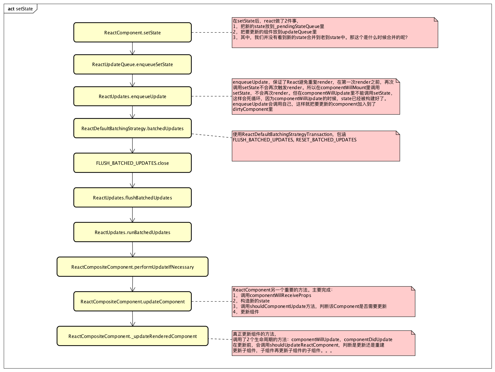

# UPDATE



## update触发条件

触发组件update的方式有以下几种方式：
* setState()
* forceUpdate()
* ReactDOM.render()

不管哪种方式，都会调用```updateComponent()```方法

## setState

### ReactComponent.setState()
``` javascript
/**
 * Sets a subset of the state. Always use this to mutate
 * state. You should treat `this.state` as immutable.
 *
 * There is no guarantee that `this.state` will be immediately updated, so
 * accessing `this.state` after calling this method may return the old value.
 *
 * There is no guarantee that calls to `setState` will run synchronously,
 * as they may eventually be batched together.  You can provide an optional
 * callback that will be executed when the call to setState is actually
 * completed.
 *
 * When a function is provided to setState, it will be called at some point in
 * the future (not synchronously). It will be called with the up to date
 * component arguments (state, props, context). These values can be different
 * from this.* because your function may be called after receiveProps but before
 * shouldComponentUpdate, and this new state, props, and context will not yet be
 * assigned to this.
 *
 * @param {object|function} partialState Next partial state or function to
 *        produce next partial state to be merged with current state.
 * @param {?function} callback Called after state is updated.
 * @final
 * @protected
 */
ReactComponent.prototype.setState = function(partialState, callback) {
  this.updater.enqueueSetState(this, partialState);
  if (callback) {
    this.updater.enqueueCallback(this, callback, 'setState');
  }
};
```

### ReactUpdateQueue.enqueueSetState
``` javascript
  /**
   * Sets a subset of the state. This only exists because _pendingState is
   * internal. This provides a merging strategy that is not available to deep
   * properties which is confusing. TODO: Expose pendingState or don't use it
   * during the merge.
   *
   * @param {ReactClass} publicInstance The instance that should rerender.
   * @param {object} partialState Next partial state to be merged with state.
   * @internal
   */
  enqueueSetState: function(publicInstance, partialState) {
    var internalInstance = getInternalInstanceReadyForUpdate(
      publicInstance,
      'setState'
    );

    if (!internalInstance) {
      return;
    }

    var queue =
      internalInstance._pendingStateQueue ||
      (internalInstance._pendingStateQueue = []);
    queue.push(partialState);

    enqueueUpdate(internalInstance);
  }
```

### ReactUpdates.enqueueUpdate
``` javascript
/**
 * Mark a component as needing a rerender, adding an optional callback to a
 * list of functions which will be executed once the rerender occurs.
 */
function enqueueUpdate(component) {
  ensureInjected();

  // Various parts of our code (such as ReactCompositeComponent's
  // _renderValidatedComponent) assume that calls to render aren't nested;
  // verify that that's the case. (This is called by each top-level update
  // function, like setState, forceUpdate, etc.; creation and
  // destruction of top-level components is guarded in ReactMount.)

  // 如果不是正处于创建或更新组件阶段,则处理update事务
  if (!batchingStrategy.isBatchingUpdates) {
    batchingStrategy.batchedUpdates(enqueueUpdate, component);
    return;
  }

  // 如果正在创建或更新组件,则暂且先不处理update,只是将组件放在dirtyComponents数组中
  // dirtyComponents会在transaction结束时被close方法处理
  dirtyComponents.push(component);
  if (component._updateBatchNumber == null) {
    component._updateBatchNumber = updateBatchNumber + 1;
  }
}
```
以上是setState后，react开始更新组件的代码。其中，我们并没有看到新的state合并到老到state中。那这个是什么时候合并的呢？

### ReactDefaultBatchingStrategy.batchedUpdates:
``` javascript
/**
 * Call the provided function in a context within which calls to `setState`
 * and friends are batched such that components aren't updated unnecessarily.
 */
batchedUpdates: function(callback, a, b, c, d, e) {
  var alreadyBatchingUpdates = ReactDefaultBatchingStrategy.isBatchingUpdates;

  ReactDefaultBatchingStrategy.isBatchingUpdates = true;

  // The code is written this way to avoid extra allocations
  if (alreadyBatchingUpdates) {
    return callback(a, b, c, d, e);
  } else {
    // transaction is ReactDefaultBatchingStrategyTransaction
    return transaction.perform(callback, null, a, b, c, d, e);
  }
}
```
enqueueUpdate包含了React避免重复render的逻辑。mountComponent和updateComponent方法在执行的最开始，会调用到batchedUpdates进行批处理更新，此时会将isBatchingUpdates设置为true，也就是将状态标记为现在正处于更新阶段了。之后React以事务的方式处理组件update，事务处理完后会调用wrapper.close(), 而TRANSACTION_WRAPPERS中包含了RESET_BATCHED_UPDATES这个wrapper，故最终会调用RESET_BATCHED_UPDATES.close(), 它最终会将isBatchingUpdates设置为false。

在componentWillMount中调用setState会防止重复render，但在render，componentWillUpdate和componentDidUpdate中千万不要调用setState，这样会引起死循环

在```ReactDefaultBatchingStrategyTransaction```中的```FLUSH_BATCHED_UPDATES```的```close```中，会调用```ReactUpdates.flushBatchedUpdates```。这个方法会对dirtyComponent中的每一个component调用```ReactUpdates.runBatchedUpdates```

### ReactUpdates.flushBatchedUpdates

``` javascript
var flushBatchedUpdates = function () {
  // ReactUpdatesFlushTransaction's wrappers will clear the dirtyComponents
  // array and perform any updates enqueued by mount-ready handlers (i.e.,
  // componentDidUpdate) but we need to check here too in order to catch
  // updates enqueued by setState callbacks and asap calls.
  while (dirtyComponents.length || asapEnqueued) {
    if (dirtyComponents.length) {
      var transaction = ReactUpdatesFlushTransaction.getPooled();
      transaction.perform(runBatchedUpdates, null, transaction);
      ReactUpdatesFlushTransaction.release(transaction);
    }

    if (asapEnqueued) {
      asapEnqueued = false;
      var queue = asapCallbackQueue;
      asapCallbackQueue = CallbackQueue.getPooled();
      queue.notifyAll();
      CallbackQueue.release(queue);
    }
  }
};
```

### runBatchedUpdates
``` javascript
function runBatchedUpdates(transaction) {
  var len = transaction.dirtyComponentsLength;
  invariant(
    len === dirtyComponents.length,
    'Expected flush transaction\'s stored dirty-components length (%s) to ' +
    'match dirty-components array length (%s).',
    len,
    dirtyComponents.length
  );

  // Since reconciling a component higher in the owner hierarchy usually (not
  // always -- see shouldComponentUpdate()) will reconcile children, reconcile
  // them before their children by sorting the array.
  // 按照组件的挂载顺序排序dirtyComponent，保证更新顺序是按照挂载顺序
  dirtyComponents.sort(mountOrderComparator);

  // Any updates enqueued while reconciling must be performed after this entire
  // batch. Otherwise, if dirtyComponents is [A, B] where A has children B and
  // C, B could update twice in a single batch if C's render enqueues an update
  // to B (since B would have already updated, we should skip it, and the only
  // way we can know to do so is by checking the batch counter).
  updateBatchNumber++;

  for (var i = 0; i < len; i++) {
    // If a component is unmounted before pending changes apply, it will still
    // be here, but we assume that it has cleared its _pendingCallbacks and
    // that performUpdateIfNecessary is a noop.
    var component = dirtyComponents[i];

    // If performUpdateIfNecessary happens to enqueue any new updates, we
    // shouldn't execute the callbacks until the next render happens, so
    // stash the callbacks first
    var callbacks = component._pendingCallbacks;
    component._pendingCallbacks = null;

    var markerName;
    if (ReactFeatureFlags.logTopLevelRenders) {
      var namedComponent = component;
      // Duck type TopLevelWrapper. This is probably always true.
      if (component._currentElement.type.isReactTopLevelWrapper) {
        namedComponent = component._renderedComponent;
      }
      markerName = 'React update: ' + namedComponent.getName();
      console.time(markerName);
    }

    ReactReconciler.performUpdateIfNecessary(
      component,
      transaction.reconcileTransaction,
      updateBatchNumber
    );

    if (markerName) {
      console.timeEnd(markerName);
    }

    if (callbacks) {
      for (var j = 0; j < callbacks.length; j++) {
        transaction.callbackQueue.enqueue(
          callbacks[j],
          component.getPublicInstance()
        );
      }
    }
  }
}
```

### ReactCompositeComponent.performUpdateIfNecessary
``` javascript
/**
 * If any of `_pendingElement`, `_pendingStateQueue`, or `_pendingForceUpdate`
 * is set, update the component.
 *
 * @param {ReactReconcileTransaction} transaction
 * @internal
 */
performUpdateIfNecessary: function(transaction) {
  // _pendingElement, 是在ReactMount._renderSubtreeIntoContainer里设置的（通过_updateRootComponent）
  if (this._pendingElement != null) {
    ReactReconciler.receiveComponent(
      this,
      this._pendingElement,
      transaction,
      this._context
    );
  } else if (this._pendingStateQueue !== null || this._pendingForceUpdate) {
    this.updateComponent(
      transaction,
      this._currentElement,
      this._currentElement,
      this._context,
      this._context
    );
  } else {
    this._updateBatchNumber = null;
  }
}
```

### ReactCompositeComponent.updateComponent

``` javascript
/**
 * Perform an update to a mounted component. The componentWillReceiveProps and
 * shouldComponentUpdate methods are called, then (assuming the update isn't
 * skipped) the remaining update lifecycle methods are called and the DOM
 * representation is updated.
 *
 * By default, this implements React's rendering and reconciliation algorithm.
 * Sophisticated clients may wish to override this.
 *
 * @param {ReactReconcileTransaction} transaction
 * @param {ReactElement} prevParentElement
 * @param {ReactElement} nextParentElement
 * @internal
 * @overridable
 */
updateComponent: function(
  transaction,
  prevParentElement,
  nextParentElement,
  prevUnmaskedContext,
  nextUnmaskedContext
) {
  var inst = this._instance;

  var willReceive = false;
  var nextContext;

  // Determine if the context has changed or not
  if (this._context === nextUnmaskedContext) {
    nextContext = inst.context;
  } else {
    nextContext = this._processContext(nextUnmaskedContext);
    willReceive = true;
  }

  var prevProps = prevParentElement.props;
  var nextProps = nextParentElement.props;

  // Not a simple state update but a props update
  if (prevParentElement !== nextParentElement) {
    willReceive = true;
  }

  // An update here will schedule an update but immediately set
  // _pendingStateQueue which will ensure that any state updates gets
  // immediately reconciled instead of waiting for the next batch.
  // 在componentWillReceiveProps中setState，将立即生效，而不是等到下一轮update
  if (willReceive && inst.componentWillReceiveProps) {
    inst.componentWillReceiveProps(nextProps, nextContext);
  }

  // 重构新的state
  var nextState = this._processPendingState(nextProps, nextContext);
  var shouldUpdate = true;

  if (!this._pendingForceUpdate) {
    if (inst.shouldComponentUpdate) {
      shouldUpdate = inst.shouldComponentUpdate(nextProps, nextState, nextContext);
    } else {
      if (this._compositeType === CompositeTypes.PureClass) {
        shouldUpdate =
          !shallowEqual(prevProps, nextProps) ||
          !shallowEqual(inst.state, nextState);
      }
    }
  }

  this._updateBatchNumber = null;
  if (shouldUpdate) {
    this._pendingForceUpdate = false;
    // Will set `this.props`, `this.state` and `this.context`.
    this._performComponentUpdate(
      nextParentElement,
      nextProps,
      nextState,
      nextContext,
      transaction,
      nextUnmaskedContext
    );
  } else {
    // If it's determined that a component should not update, we still want
    // to set props and state but we shortcut the rest of the update.
    this._currentElement = nextParentElement;
    this._context = nextUnmaskedContext;
    inst.props = nextProps;
    inst.state = nextState;
    inst.context = nextContext;
  }
}
```

`updateComponent`主要完成以下工作：
* 调用componentWillReceiveProps方法
* 构造新的state
* 调用shouldComponentUpdate方法，判断该component是否需要被更新
* 更新组件

### ReactCompositeComponent.\_performComponentUpdate

``` javascript
/**
   * Merges new props and state, notifies delegate methods of update and
   * performs update.
   *
   * @param {ReactElement} nextElement Next element
   * @param {object} nextProps Next public object to set as properties.
   * @param {?object} nextState Next object to set as state.
   * @param {?object} nextContext Next public object to set as context.
   * @param {ReactReconcileTransaction} transaction
   * @param {?object} unmaskedContext
   * @private
   */
  _performComponentUpdate: function(
    nextElement,
    nextProps,
    nextState,
    nextContext,
    transaction,
    unmaskedContext
  ) {
    var inst = this._instance;

    var hasComponentDidUpdate = Boolean(inst.componentDidUpdate);
    var prevProps;
    var prevState;
    var prevContext;
    if (hasComponentDidUpdate) {
      prevProps = inst.props;
      prevState = inst.state;
      prevContext = inst.context;
    }

    if (inst.componentWillUpdate) {
      inst.componentWillUpdate(nextProps, nextState, nextContext);
    }

    this._currentElement = nextElement;
    this._context = unmaskedContext;
    inst.props = nextProps;
    inst.state = nextState;
    inst.context = nextContext;

    this._updateRenderedComponent(transaction, unmaskedContext);

    if (hasComponentDidUpdate) {
      transaction.getReactMountReady().enqueue(
        inst.componentDidUpdate.bind(inst, prevProps, prevState, prevContext),
        inst
      );
    }
  }
```


\_performComponentUpdate是真正的更新方法，在这里调用了2个生命周期方法
* componentWillUpdate
* componentDidUpdate, componentDidUpdate和componentDidMount一样，放到queue里，等transaction结束后，通过notifyAll来触发

### ReactCompositeComponent.\_updateRenderedComponent

``` javascript
/**
 * Call the component's `render` method and update the DOM accordingly.
 *
 * @param {ReactReconcileTransaction} transaction
 * @internal
 */
_updateRenderedComponent: function(transaction, context) {
  var prevComponentInstance = this._renderedComponent;
  var prevRenderedElement = prevComponentInstance._currentElement;

  // 调用组件的render方法，得到组件的新的ReactElement
  var nextRenderedElement = this._renderValidatedComponent();

  var debugID = 0;

  if (shouldUpdateReactComponent(prevRenderedElement, nextRenderedElement)) {
    // 用新的ReactElement更新component
    // _renderedComponent就是这个当前component的child，一般会是div
    // 这里会调用相应的component的方法，ReactCompositeComponent或者ReactDOMComponent
    // ReactCompositeComponent和ReactDOMComonent的ReceiveComponent都会调用对应的updateComponent
    ReactReconciler.receiveComponent(
      prevComponentInstance,
      nextRenderedElement,
      transaction,
      this._processChildContext(context)
    );
  } else {
    var oldHostNode = ReactReconciler.getHostNode(prevComponentInstance);
    ReactReconciler.unmountComponent(prevComponentInstance, false);

    var nodeType = ReactNodeTypes.getType(nextRenderedElement);
    this._renderedNodeType = nodeType;
    var child = this._instantiateReactComponent(
      nextRenderedElement,
      nodeType !== ReactNodeTypes.EMPTY /* shouldHaveDebugID */
    );
    this._renderedComponent = child;

    var nextMarkup = ReactReconciler.mountComponent(
      child,
      transaction,
      this._hostParent,
      this._hostContainerInfo,
      this._processChildContext(context),
      debugID
    );

    this._replaceNodeWithMarkup(
      oldHostNode,
      nextMarkup,
      prevComponentInstance
    );
  }
}
```

## flattenChildren
再更新子组件时，有一个比较重要的步骤，就是拉平子组件
比如以下jsx代码
``` html
<div>
  <span>{this.state.msg}</span>
  {
    this.props.app.map((v) => {
      return (<h2 key={v}>{v}</h2>)
    })
  }
</div>
```
这个对应的children结构是```[Object, Array[2]]```
拉平以后：
``` javascript
{
  '.0': Object,
  '.1:$a': Object,
  '.1:$b': Object
}
```
其中，'.1:$a'中的'a'，是这个组件的key。
这就是为什么我们在遍历数组生成组件的时候要给一个key，而且这个key不能是index。react在更新子组件的时候，会判断要更新的组件在以前是不是有，如果有，则更新那个组件，这种情况下，react会判断这个组件是不是更改了，如果没改，就不会更新他（更新DOM）。但如果没有key，react会按照组件在子组件组中的index来给他命名。这样，名字一样，但有可能并不是一个组件。这也是为什么不要用index做为key。

接下来，就是调用每个子组件的updateComponent，一层一层调下去，直到最后一层。递归这个过程
