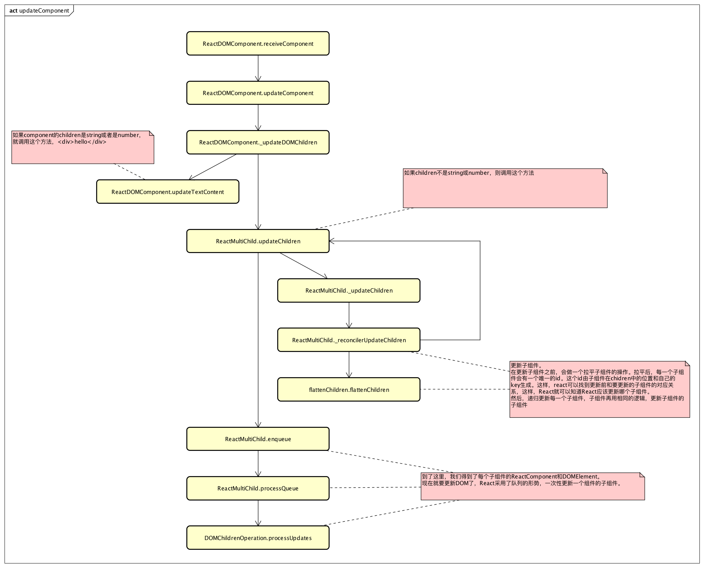

# updateComponent



updateComponent，在react中要比mountComponent复杂一些。
ReactCompositeComponent和ReactDOMComponent的update逻辑差别较大，对于ReactCompositeComponent，主要是调用几个生命周期方法，并调用子组件的updateComponent方法。
ReactCompositeComponent一般都是ReactDOMComponent组成的，所以最终的update操作，会主要由ReactDOMComponent完成。

## ReactDOMComponent.\_updateDOMChildren
``` javascript
/**
 * Reconciles the children with the various properties that affect the
 * children content.
 *
 * @param {object} lastProps
 * @param {object} nextProps
 * @param {ReactReconcileTransaction} transaction
 * @param {object} context
 */
_updateDOMChildren: function(lastProps, nextProps, transaction, context) {
  var lastContent =
    CONTENT_TYPES[typeof lastProps.children] ? lastProps.children : null;
  var nextContent =
    CONTENT_TYPES[typeof nextProps.children] ? nextProps.children : null;

  var lastHtml =
    lastProps.dangerouslySetInnerHTML &&
    lastProps.dangerouslySetInnerHTML.__html;
  var nextHtml =
    nextProps.dangerouslySetInnerHTML &&
    nextProps.dangerouslySetInnerHTML.__html;

  // Note the use of `!=` which checks for null or undefined.
  var lastChildren = lastContent != null ? null : lastProps.children;
  var nextChildren = nextContent != null ? null : nextProps.children;

  // If we're switching from children to content/html or vice versa, remove
  // the old content
  var lastHasContentOrHtml = lastContent != null || lastHtml != null;
  var nextHasContentOrHtml = nextContent != null || nextHtml != null;
  if (lastChildren != null && nextChildren == null) {
    this.updateChildren(null, transaction, context);
  } else if (lastHasContentOrHtml && !nextHasContentOrHtml) {
    this.updateTextContent('');
  }

  // 比较更新前后的内容是否一样
  // 不一样，则更新
  if (nextContent != null) {
    if (lastContent !== nextContent) {
      this.updateTextContent('' + nextContent);
    }
  } else if (nextHtml != null) {
    // 比较更新前后的html是否一样
    // 不一样，则更新
    if (lastHtml !== nextHtml) {
      this.updateMarkup('' + nextHtml);
    }
  } else if (nextChildren != null) {

    // 更新子组件
    this.updateChildren(nextChildren, transaction, context);
  }
}
```

## ReactMultiChild.\_reconcilerUpdateChildren

``` javascript
_reconcilerUpdateChildren: function(
  prevChildren,
  nextNestedChildrenElements,
  mountImages,
  removedNodes,
  transaction,
  context
) {
  var nextChildren;
  var selfDebugID = 0;
  // 拉平子组件
  nextChildren = flattenChildren(nextNestedChildrenElements, selfDebugID);

  // 递归更新各个子组件
  ReactChildReconciler.updateChildren(
    prevChildren,
    nextChildren,
    mountImages,
    removedNodes,
    transaction,
    this,
    this._hostContainerInfo,
    context,
    selfDebugID
  );
  return nextChildren;
}
```

## flattenChildren.flattenChildren

再更新子组件时，有一个比较重要的步骤，就是拉平子组件
比如以下jsx代码
``` html
<div>
  <span>{this.state.msg}</span>
  {
    this.props.app.map((v) => {
      return (<h2 key={v}>{v}</h2>)
    })
  }
</div>
```
这个对应的children结构是```[Object, Array[2]]```
拉平以后：
``` javascript
{
  '.0': Object,
  '.1:$a': Object,
  '.1:$b': Object
}
```
其中，'.1:$a'中的'a'，是这个组件的key。
这就是为什么我们在遍历数组生成组件的时候要给一个key，而且这个key不能是index。react在更新子组件的时候，会判断要更新的组件在以前是不是有，如果有，则更新那个组件，这种情况下，react会判断这个组件是不是更改了，如果没改，就不会更新他（更新DOM）。但如果没有key，react会按照组件在子组件组中的index来给他命名。这样，名字一样，但有可能并不是一个组件。这也是为什么不要用index做为key。

接下来，就是调用每个子组件的updateComponent，一层一层调下去，直到最后一层。递归这个过程。

在对每一个子组件调用updateComponent后，我们就得到了每一个子组件对ReactComponent和DOMElement。
接下来要做的，就是把当前的子组件的DOMElement插入到DOM树中。

对于插入dom树的操作，React采取了先获取每个子组件的ReactComponent，再统一更新DOM的策略。ReactMultiChild维护了一个queue，每一个子组件，根据更新方式的不同（更新，新增等），统一处理。

## DOMChildrenOperations.processUpdates

其中，更新方式有以下几种：
* INSERT_MARKUP: 正常的更新
* MOVE_EXISTING: 移动已存在的子组件的位置
* SET_MARKUP: 更新子组件的innerHTML
* TEXT_CONTENT: 设置组件的text
* REMOVE_NODE: 删除组件

``` javascript
/**
 * Updates a component's children by processing a series of updates. The
 * update configurations are each expected to have a `parentNode` property.
 *
 * @param {array<object>} updates List of update configurations.
 * @internal
 */
processUpdates: function(parentNode, updates) {
  for (var k = 0; k < updates.length; k++) {
    var update = updates[k];
    switch (update.type) {
      case 'INSERT_MARKUP':
        insertLazyTreeChildAt(
          parentNode,
          update.content,
          getNodeAfter(parentNode, update.afterNode)
        );
        break;
      case 'MOVE_EXISTING':
        moveChild(
          parentNode,
          update.fromNode,
          getNodeAfter(parentNode, update.afterNode)
        );
        break;
      case 'SET_MARKUP':
        setInnerHTML(
          parentNode,
          update.content
        );
        break;
      case 'TEXT_CONTENT':
        setTextContent(
          parentNode,
          update.content
        );
        break;
      case 'REMOVE_NODE':
        removeChild(parentNode, update.fromNode);
        break;
    }
  }
}
```
